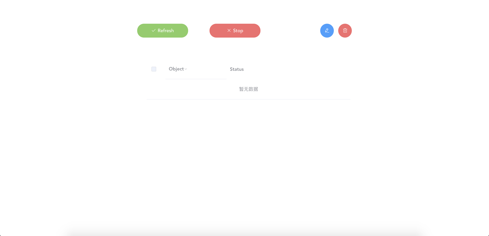
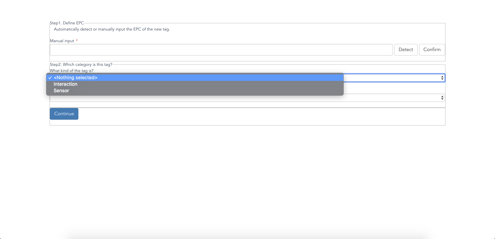
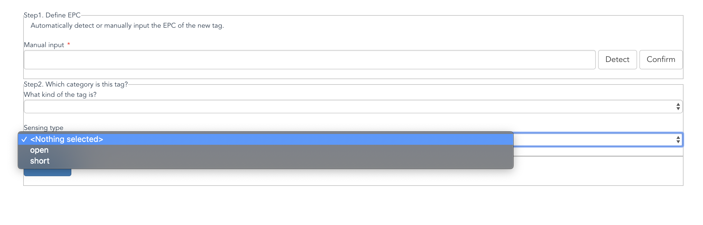
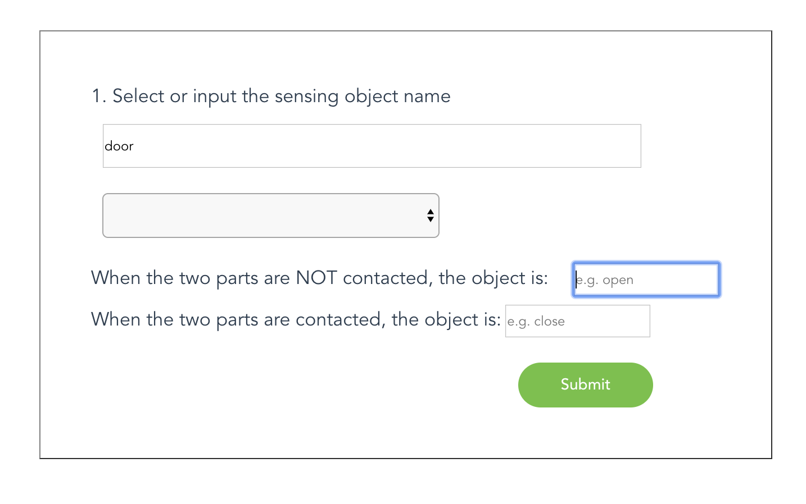
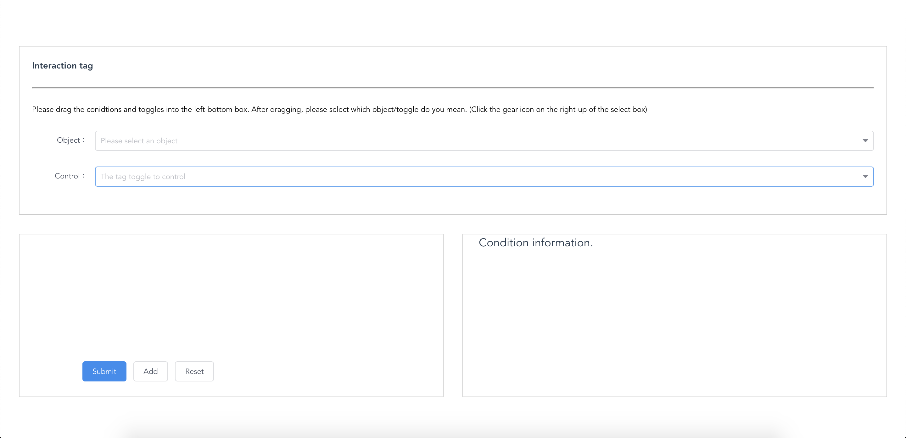

# BitID Client

This repository is for the BitID frontend, which is a web-based app. With the client, the users can customize the behavior when som specific BitID sensors' states change. For example, one could easily define "when the door is open and the chair is sitten, turn on the lamp", with the GUI.

**You should use the client along with the backend, AutoID-Server, to support RFID tags sensing and objects controlling.**
[Backend repo](https://github.com/AlexFxw/AutoID-server)

## Environment

node@8.16.0

TypeScript, Vue.js, Element-UI

## Usage

### Installation

```bash
git submodule init
git submodule update
npm i
```

### Run

```bash
npm start
```

Then you can visit `localhost:8080` to use the client.

## How to use?

### Homepage



You can view all the registered objects states here, and you can add or remove a new tag here.

### How to add a new tag?

#### Step1: Input/Detect the EPC


You can manually input the EPC of the BitID tag or approach the tag to the antenna to automatically detect it.

#### Step2: Assign the category



Interaction: the tag is related to an object interactable, like a lamp. You will required to define the behavior of the tag later.

Sensor: the tag is related to objects that reflect states rather than control something.



Besides, you need to decide whether the sensing type is open or short. Please refer the paper for the definition of the type.

#### Step3: Define a sensor



If you select "sensor" type in step 2, you will see the page above. You can define what object is the tag attached to, and you can define the semantic meaning of the ON/OFF state. After defining the sensors, you could use it to customize an interaction for an interaction tag.

#### Step4: Define an interaction



As you can see, there are two items to select here. You could drag the "object" to the left box, and select an object and its specific state from the list. On the other hand, you should drag "Control" to the right, which means when the condition defined by the left side meets, the behavior should be triggered.

For example, you can drag two "Object" list to the left. One of them may be "Door -> opened" while another one may be a "Drawer -> opened".

> The states are defined with the method described in step3.

And the after dragging "Control" to the right and select "Play the music" maybe, you can add the behavior.
What you have done means "When the door is opened and the drawer is opened as well, play the music."