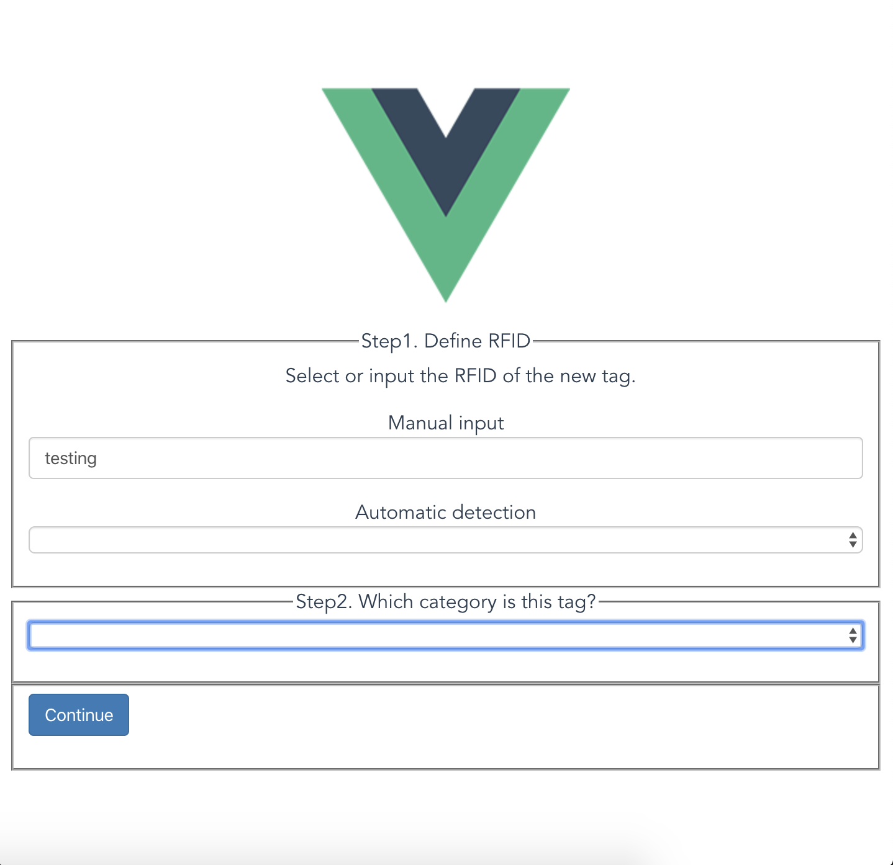
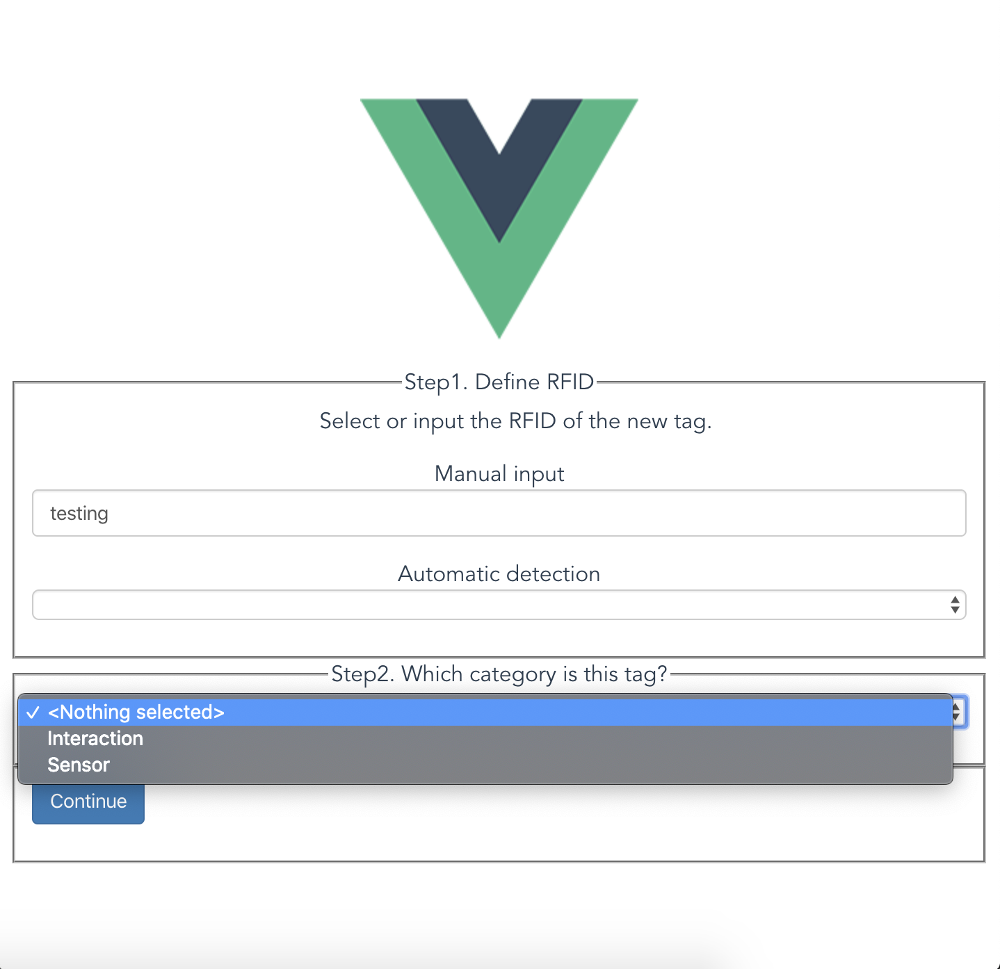
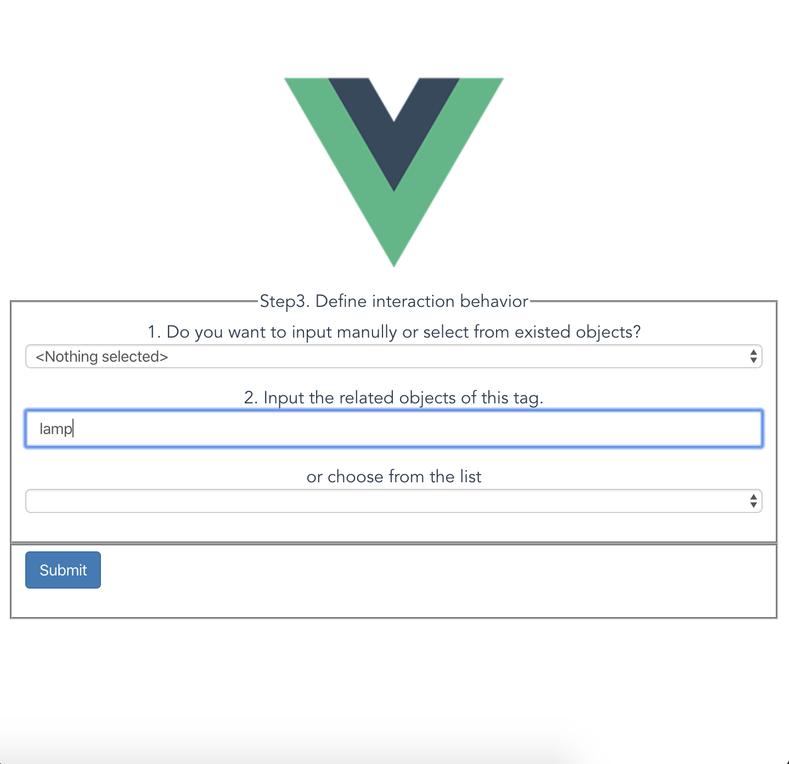

# BitID Client

This repository is for the BitID frontend, which is a web-based app. With the client, the users can customize the behavior when som specific BitID sensors' states change. For example, one could easily define "when the door is open and the chair is sitten, turn on the lamp", with the GUI.

**You should use the client along with the backend to support RFID tags sensing and objects controlling.**

# Development Environment

node@8.16.0

TypeScript, Vue.js, Element-UI

# Usage

```bash
npm i
npm start
```

Then you can visit `localhost:8080` to use the client.

# Step-by-step tutorial

## Step1: Define the RFID tag



You can manually input the EPC of the BitID tag or approach the tag to the antenna to automatically detect it.

## Step2: Assign the category



Interaction: the tag is related to an object interactable, like a lamp.

Sensor: the tag is related to objects that reflect states rather than control something.

## Step3:



Manually input the objects related to this tag, or choose from the existed ones.